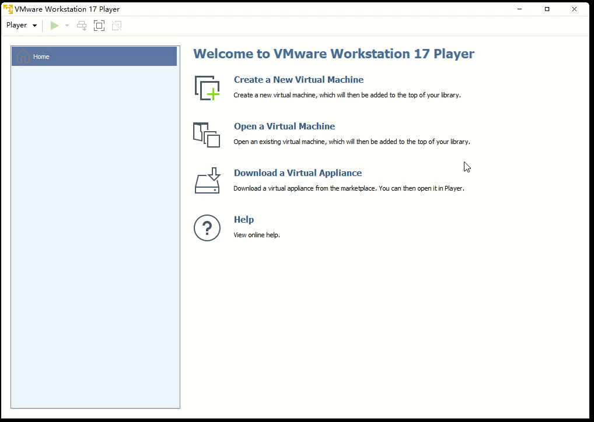
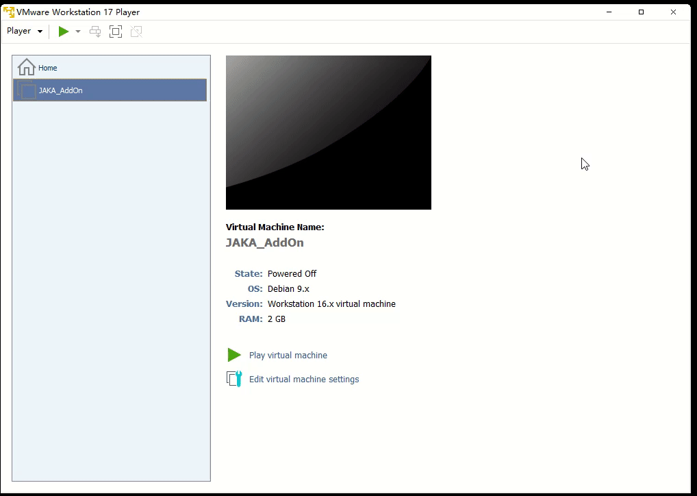
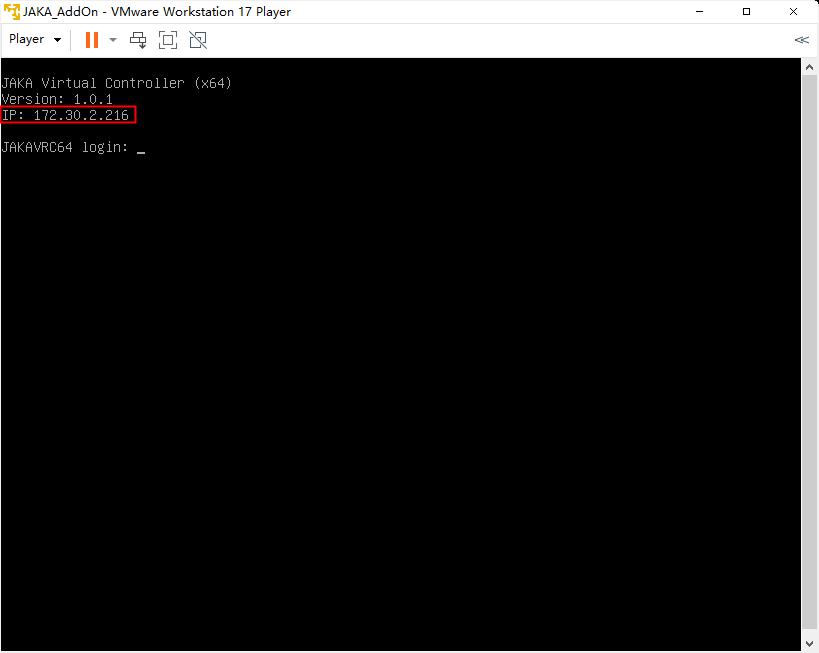
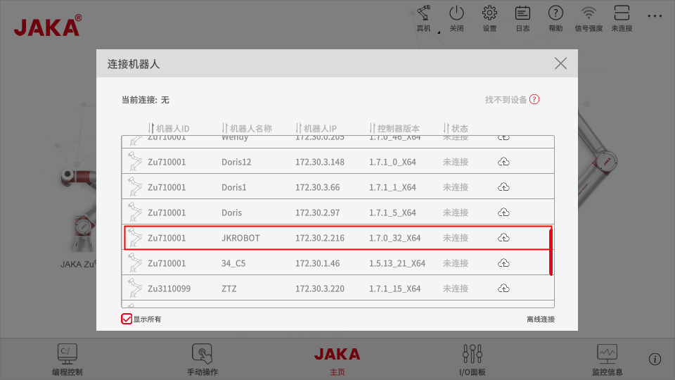
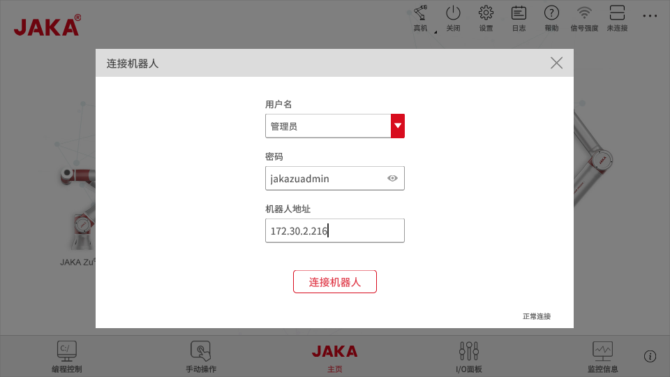

English document link: 

## 安装JAKA虚拟机
---
### 安装虚拟机软件

&emsp;&emsp;用户需要自行安装虚拟机软件，例如VirtualBox 或 VMware Player。

### 安装JAKA虚拟镜像
&emsp;&emsp;在*jaka_addon_package*中找到虚拟机镜像文件，导入安装。

###  启动JAKA虚拟控制器
&emsp;&emsp;点击“开启此虚拟机”启动虚拟机。

&emsp;&emsp;此时虚拟机页面上显示了当前机器人的IP地址。

## 连接虚拟机
---
###  安装App

1.获取所需版本的App安装包，点击根据引导安装完成APP。在安装过程中要注意给予网络权限。

###  使用App连接机器人

1.打开APP连接机器人，此时可在机器人列表中根据IP找到虚拟机器人。

2.若在列表中无法找到机器人，可尝试使用离线连接。

3.密码填入默认登录密码（jakazuadmin）

4.地址填入虚拟机器人IP

