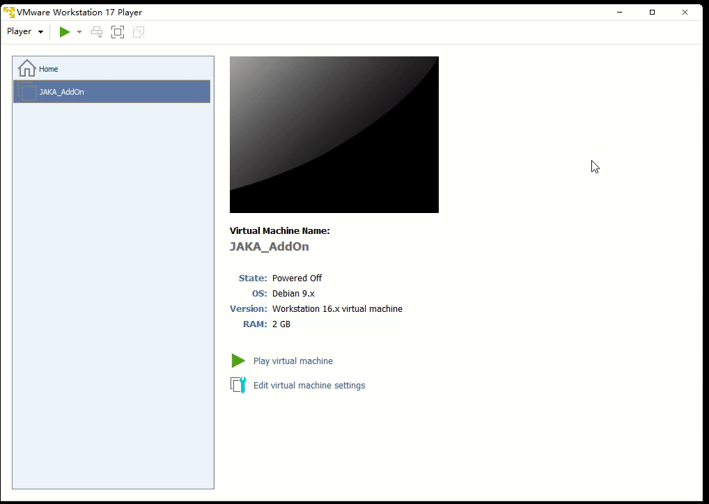
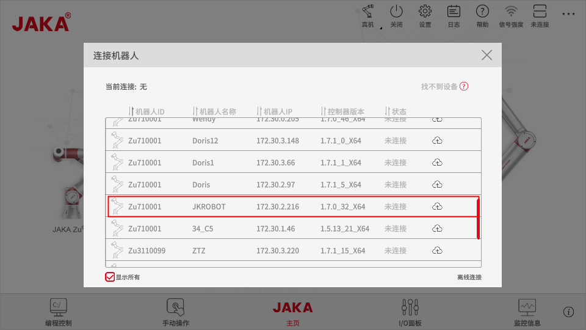

Chinese document [link](./README.md)

## Installing JAKA Virtual Machine
---
### Installing Virtual Machine Software

&emsp;&emsp;Users need to install virtual machine software on their own, such as VirtualBox or VMware Player.

### Installing JAKA Virtual Image
&emsp;&emsp;Locate the virtual machine image file in the *jaka_addon_package* and import it for installation.

### Starting JAKA Virtual Controller
&emsp;&emsp;Click "Start this Virtual Machine" to launch the virtual machine.

&emsp;&emsp;At this point, the virtual machine page displays the IP address of the current robot.

## Connecting to the Virtual Machine
---
### Installing the App

1. Obtain the installation package for the required version of the App and follow the prompts to complete the installation. During the installation process, be sure to grant network permissions.

### Connecting to the Robot Using the App

1. Open the App to connect to the robot. At this point, you can find the virtual robot in the robot list based on its IP.

2. If the robot cannot be found in the list, try using offline connection.

3. Enter the default login password (jakazuadmin).

4. Enter the IP of the virtual robot.

